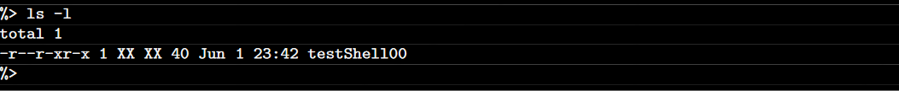
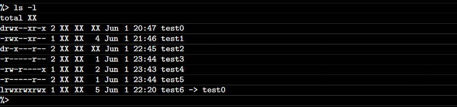
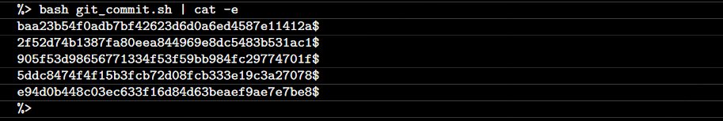
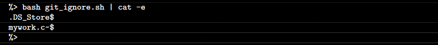
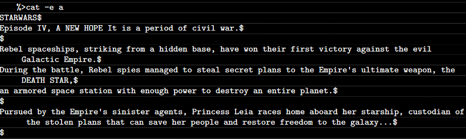
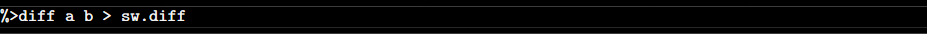

# Shell 00       

## Summary
- Exercise 00 : Simply to understand usage of cat command.
- Exercise 01 : Simply to understand usage of ls command.
- Exercise 02 : to understand usage of ls command and attributes.
- Exercise 03 : to understanding how to get SSH Key.
- Exercise 04 : to understand additional ls command attributes.
- Exercise 05 : to understand how do you get last commits.
- Exercise 06 : to understand hidden git files and how do you handle them.
- Exercise 07 : to learn git diff command.
- Exercise 08 : to learn (find -type) + exceptions, printf and delete command in bash
- Exercise 09 : to learn how do you handle a file which has different extension

**Project Instructions**

<details>
  <summary>Exercise 00</summary>

- Exercise 00 - Only the best know how to display Z
  
  - Create a file called z that return "Z", followed by a new line, whenever the command cat is used on it.
  
</details>

<details>
  <summary>Exercise 01</summary>
  
  - Exercise 01 - What are attributes anyway?

    - Create a file called testShell00 in your submission directory.
    - Figure out a way for the output to look like this (expect for the "total 1" line)
    
    - Once you have achieved the previous step, execute the following command to create the file to be submitted: ```$> tar -cf testShell00.tar testShell00```
</details>
  
<details>
  <summary>Exercise 02</summary>

  - Exercise 02 - Oh yeah, mooore...
  
    - Create the following files and directories. Do what's necessary so that when you use the ls -l command in your directory, the output will looks like this:
    
    - Once you have done that, run ```$> tar -cf exo2.tar *``` to create the file to be submitted.
  
</details>

<details>
  <summary>Exercise 03</summary>

  - Exercise 03 - SSH Key
  
    - Create your own SSH key. Once it is done:
      - Add your public key to your repository, in a file name id_rsa_pub
      - Update your ssh key on the intranet. This will allow you to push the repository to our git server.

</details>

<details>
  <summary>Exercise 04</summary>

  - Exercise 04 - midLS
    - In a midLS file, place the command line that will list all files and directories in your current directory (except for hidden files or any file that starts by a dot - yes, that includes double-dots), separated by a comma, by order of modification date. Make sure the directory’s names are followed by a slash character.
  
 </details>

<details>
  <summary>Exercise 05</summary>

  - Exercise 05 - GiT commit?

    - Create a shell script that displays the ids of the last 5 commits of your git respository.
  
  
</details>

<details>
  <summary>Exercise 06</summary>
  
  - Exercise 06 - gitignore
    - In this exercise, you will write a short shell script last lists all the existing files ignored by your GiT repository. Example:
    
  
</details>

<details>
  <summary>Exercise 07</summary>
  
  - Exercise 07 - diff
    - Create a file b, so that :
    
    
  
 </details>
 
 <details>
  <summary>Exercise 08</summary>

  - Exercise 08 - clean
    - In a file called clean place the command line that will search for all files - in the current directory as well as in its sub-directories - with a name ending by ~, or a name that start and end by #
    - The command line will show and erase all files found
    -   Only one command is allowed: no ';' or '&&' or other shenanigans
  
 </details>
 
 <details>
  <summary>Exercise 09</summary>

  - Exercise 09 - Illusions, not tricks, Micheal...
    - Create a magic file called ft_magic that will be formatted appropriately to detect file of 42 file type, built with a "42" string at the 42nd byte.
  
 </details>
