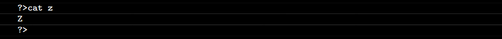

# Shell 00

- Exercise 00 - Only the best know how to display Z
  - Create a file called z that return "Z", followed by a new line, whenever the command cat is used on it.
  
- Exercise 01 - What are attributes anyway?
  - Create a file called testShell00 in your submission directory.
  - Figure out a way for the output to look like this (expect for the "total 1" line)
  - Once you have achieved the previous step, execute the following command to create the file to be submitted: $> tar -cf testShell00.tar testShell00
- Exercise 02 - Oh yeah, mooore...
  - Create the following files and directories. Do what's necessary so that when you use the ls -l command in your directory, the output will looks like this:

  - Once you have done that, run  to create the file to be submitted.
- Exercise 03 - SSH Key
  - Create your own SSH key. Once it is done:
    - Add your public key to your 

[`NO_COLOR`](https://no-color.org)
